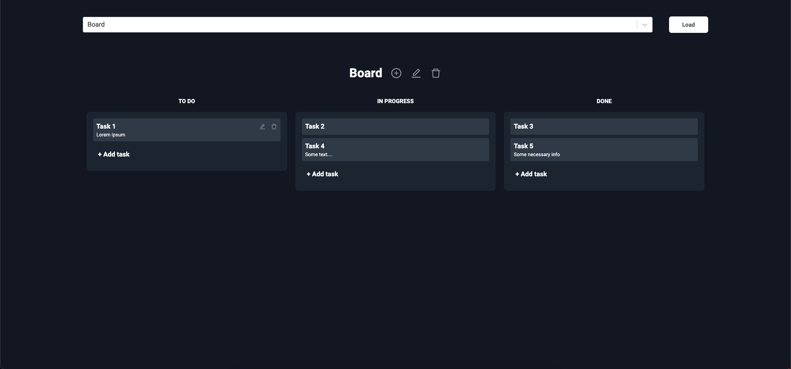

Kanban board based on fullstack framework NextJS

Instructions to launch the project:

Install NodeJs
Clone a repository
Open a repository 
Enter 'npm i' or 'npm install' command in cmd in project repository
Enter 'npm run dev' command in cmd in project repository